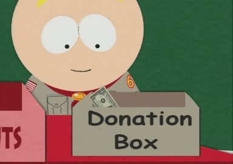

# Hello, welcome to my page!

I'm a front end developer. I mainly work with the Vue stack and also write the back end in NodeJS. I develop free software based on requests for imageboard on streams. 

 

If you want, you can give me your money by clicking on the box:

